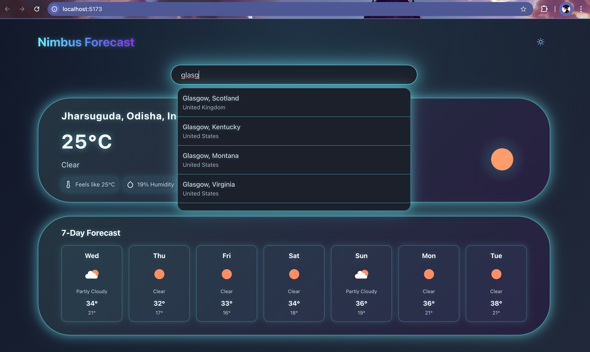

# NIMBUS Forecast - Modern Weather Application

A sophisticated weather application built with React and powered by OpenMeteo API. This project demonstrates the implementation of a modern weather interface with focus on user experience and clean design.

## Project Overview

NIMBUS Forecast is developed to showcase real-time weather data in an elegant and user-friendly interface. The application features a responsive design with light/dark theme support, focusing on both functionality and aesthetic appeal.

## Screenshots

### Light Mode

*Modern interface with light theme and weather information*

### Dark Mode

*Elegant dark theme with neon accents*

## Core Features

### Current Implementation
* Real-time weather data integration using OpenMeteo API
* 7-day weather forecast with detailed information
* Responsive design with light/dark theme support
* Location-based weather search
* Modern gradient UI elements
* Error handling and recovery
* Default location (New Delhi) support

### Planned Enhancements
* Enhanced weather features
  - Hourly forecast view
  - Weather alerts
  - Air quality index
* Advanced UI features
  - Custom theme colors
  - Weather map integration
  - Location favorites
* Progressive Web App (PWA) implementation

## Technical Stack

* Frontend: React + Vite
* Weather API: OpenMeteo
* Styling: Chakra UI with custom animations
* TypeScript: Strict mode enabled

## Setup Guide

1. Clone the repository:
```bash
git clone [your-repo-url]
cd nimbus-forecast
```

2. Install dependencies:
```bash
npm install
```

3. Launch development server:
```bash
npm run dev
```

## Development Notes

### API Configuration
The application uses OpenMeteo's free API, which doesn't require any API keys. This makes the setup process simpler and more accessible.

### Best Practices
* Follow TypeScript best practices
* Maintain consistent code style
* Test in both light and dark modes
* Ensure responsive design across all devices

## Contributing

Contributions are welcome. Please follow these steps:
1. Fork the repository
2. Create a feature branch
3. Submit a pull request with detailed description
4. Ensure all tests pass

## Contact

For inquiries or collaboration opportunities, please reach out through:
anshdevnagar@gmail.com

---
Developed by Ansh Dev Nagar
